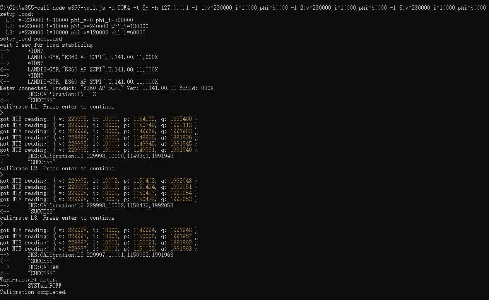

# E355 Calibration Tool

This tool automates the meter calibration process defined by E355. It connects to a meter under test (MUT) over serial port and talks to a REST service ([MTE service](https://github.com/woowu/mte-service)) for control and poll a Meter Test Equipment (MTE) in the network. The MTE service is another project which provides e355-cali an universal RESP interface (API) to physical MTE's. 

The general process of an automatic calibration is:

1. Test optical cable connection by sending `*IDN` to the meter.
2. Call the MTE service to Setup MTE load according to load definitions provided
   by user from the command line.
3. Poll the v,i,p,q readings from the MTE over the MTE service; wait the
   readings reliable.
4. Use the read values (v,i,p,q) polled from the MTE to issue calibration SCPI
   commands to the meter -- for one or more phases.
5. Send SCPI command to meter to save the calibration values -- automatic issue
   the 'Continue' command for 1p2e meter because the additional power cycle.
6. Warm restart the meter to complete the calibration.


## Features

- Support all the meter types: 3p, 1p, 1p2e
- Allow manual calibration without automatic interaction with a MTE.
- Talk to the MTE service in order to isolate the changes from different type of MTE's.
- The MTE service can be deployed to any suitable location in a network, separated
  from the laptop running e355-cali and connected to a meter.

## Installation

Install [Node.js](https://nodejs.org) and run the below command to install the dependencies:

```
npm install
```

## Usage

Linux:
```
./e355-cali [options]
```

Windows:
```
node e355-cali [options]
```

```
Options:
      --help        Show help                                          [boolean]
      --version     Show version number                                [boolean]
  -d, --device      Name of serial device connected to meter, e.g.,
                    /dev/ttyUSB0, COM2                       [string] [required]
  -b, --baud        Baud rate of meter connection       [number] [default: 9600]
  -t, --phase-type  Meter phase type    [required] [choices: "3p", "1p", "1p2e"]
  -h, --host        Mte service host/ip.  When no Mte service host provided,
                    real load values are required to be entered manually.
                                                                        [string]
  -p, --port        Mte service TCP por                 [number] [default: 6200]
  -l, --load        Specify the load paramters for one line             [string]
  -z, --freq        Network frequency                  [number] [default: 50000]
  -y, --yes         skip the questionaire for preparing meter before calibrating
                    each phase                                         [boolean]
```

The `--load` or `-l` option can be used multiple times to specify load definitions for multiple phase. A load definition is:

phase-number:key=value,key=value,...

Keys are:

- **v** for voltage; value is in mV.
- **l** for current; value is in mA.
- **phi** for phase angle; value is in $10^{-3}$ degree, negative degrees are allowed.

For example, `-l l:v=240e3,i=4.95e3,phi=-30e3` specifies a phase one's load is 240V, 4.95A at quadrant-four (-30 degree).

Example command line:

```
./e355-cali.js -d /dev/pts/6 -t 3p -h localhost -p 6200 \
    -l 1:v=241.2e3,i=10e3,phi=45e3 \
    -l 2:v=220.2e3,i=20e3,phi=45e3 \
    -l 3:v=240e3,i=99.2e3,phi=45e3 \
    -y
```

Screenshot:


